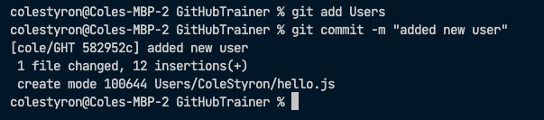

# Lesson 1

To start Lesson 1, make sure you already have the following complete:

1. You have installed git
2. You have cloned this repo
3. You have installed a code editor 

If you don't have these complete, start back [here](https://github.com/C-STYR/GitHubTrainer/tree/main/command-line).

## Setup

First things first: 

Let's open this repo in VS Code.  We're not going to be using the command line for this, though you certainly can (google it!).  Instead just open VS Code, then add this folder to a workspace. VS Code's process for this might have changed since I wrote this set of instructions, so you'll just have to figure this bit out for yourself. Once you've got this repo open in VS Code, you should see the file structure in the left hand side bar. Good.

Now, let's discuss some terminology.

You are going to be working in your code editor, editing and adding files and writing text and code of your own. Once you are happy with your work you are going to `commit` it.  This is a process akin to "saving". Committing will save all `staged` files together, not just the one open in your window. Unless you stage a file first, it will not be committed, so this has to be a deliberate process. 

Git uses `branches` to allow users to modify code safely, without changing the base code, until the changes are verified and proven. The `main` branch is the base code, and is not modified directly. Instead, a `feature branch` is created, tested, approved, and eventually `merged` into the main branch, at which time it becomes part of the base code. 

Open the integrated terminal window in VS Code (or a separate terminal window) and navigate to this repo, wherever you stored it. For me, that might look something like:
```
cd Documents
cd MyRepos
cd GitHubTrainer
```
or you could combine all that to:
```
cd Documents/MyRepos/GitHubTrainer
```
Once there, run 
```
git branch
```
You should see `* main`.  But we don't want to edit the main branch.  We want to work in a feature branch, so run
```
git checkout -b [name of feature branch]
```
My feature branch is called cole/GHT so I would have run `git checkout -b cole/GHT`.

After you've done that, run `git branch` again and see what's changed.

## Practicing with Git

Start by adding a new directory in the `Users` directory in this repo. You could do this on the command line, or you could right click on the `Users` directory and select `New folder`. Give the directory your name without spaces (or whatever you like, but this directory will be personal to you), something like `ColeStyron`.

Now right click on your directory and add a new file (`New file`) called `hello.js`.

`hello.js` will automatically open in your VS Code. Within this file, add `//` followed by a message of your choice to me. This message will be publicly viewable (!). 

`//` is how you write comments in JavaScript files.  Comments are ignored by the compiler, so you can write anything on a line that starts with `//` without worrying that it will affect the code.  Have a look in the `ColeStyron` directory in `Users`. Within it you will find a `hello.js` file there; have a peep at the file's contents to see what I mean. 

OK, now that that's done, we're ready to save our work, by which of course I mean `commit` it.

Now, on the command line (this means "at the prompt in your terminal window"), verify you're working in your feature branch and not the main branch by running `git branch`.  If you're accidentally still in `main`, run the `git checkout [branch name]` as above.

It's time to stage some files for commit. Run:
```
git status
```
and you should get a list of directories and/or files staged for commit, not staged for commit, and untracked files, if any files meet those definitions. In our case, we should at the very least see _something_.

Now run 
```
git add Users/
```
which will stage all the files in the Users directory.  This should include the new directory you've created for yourself as well as the `hello.js` file.  If we run `git status` again we should see a change. 

Now that we have some directories/files staged for commmit, we can commit them by running `git commit -m ["commit message here in quotes"]`.  My commit message will be "added new user" so the total command will be:
```
git commit -m "added new user"
```
I get the following back (yours may differ slightly): 



You'll notice that the first little bit of code returned from git was the line `[cole/GHT 582952c] added new user`.  This is a reference to the branch and the commit itself, which is a unique string of numbers/letters, followed by the commit message. Success!

But wait...what did we accomplish? More than you might think!

- we navigated through the file structure on the command line
- we learned to add folders to our workspace in VS Code
- we learned to create a feature branch locally
- we added files and directories to our file tree
- we staged files by `adding` them
- we committed those files

### So what's next? 

Next steps: 

- create a pull request
- merge our code into 