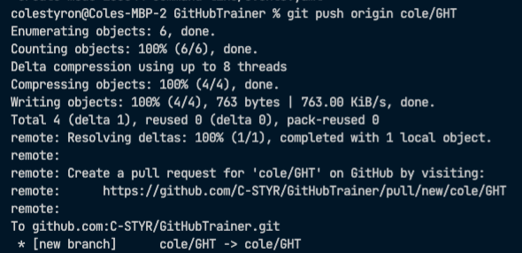

# Lesson 2

These lessons are linear, so please make sure you have completed Lesson 1 before beginning this lesson. You should: 
- have added a directory to the Users directory whose title is specific to you, e.g. `ColeStyron`
- have added a `hello.js` file to that directory with a comment in it
- successfully committed both directory and file

## Pushing and Pulling 

One of the fundamental operations in git is moving our code from place to another. We can `git push` the code on our local machine to a remote repository (somewhere else besides our machine), and we can `git pull` code from other branches or entire repos to our machine.  

Let's try it. You should still be in your feature branch (make sure by running `git branch` -- the star should be next to your feature branch). Now remember that you cloned this repo from one on GitHub? That repo is now known as the `origin`.  The origin repo has its own branches too. Before we `push` to `origin` we want to specify a branch to push to, or create one. We're going to choose the latter option. 

My local feature branch is called `cole/GHT`.  I want to create a mirror of that branch in the origin repo and push my code there.  The syntax is `git push origin [feature branch name]`, so I'm going to run
```bash
git push origin cole/GHT
```

I got this: 



## Merging and Pull Requests

Now the code that I created (a new directory and a new file) are in the origin repo, in a feature branch called `cole/GHT` just like on my machine. Since we want to make these changes part of the codebase, we need to pull them into the `main` branch in the origin repo.  Why can't we `push` them there? Because the `main` branch is protected. We don't want just anyone adding code to our `main` branch by `pushing` willy-nilly.  We want to vet which code comes in very carefully, so we require that anyone that wants to `merge` code into our `main` branch ask very nicely by submitting a `pull request`. So instead of pushing code to `main`, we pushed our code to another feature branch in the origin repo and we'll make our PR (pull request) from there. 

Merging is taking the changes, additions, and deletions from one branch and combining them with another. When we want to merge the code from a feature branch into the main branch in our origin repo, we need to make a `pull request`. Pull requests can be approved or denied. Only if they're approved can the code from the feature branch be merged. 

Point your browser to [the origin repo: github.com/C-STYR/GitHubTrainer](https://github.com/C-STYR/GitHubTrainer). Since you just pushed code to a feature branch in this repo, you should see a message across the top of the screen inviting you to submit a PR. You can click `Compare & pull request` there or follow these steps: 

1. Click `Pull requests` from the top nav menu running left-right across the top of the screen
2. Click `New pull request` on the right hand side of the screen
3. Under `Compare changes` click the box that says `compare: main` and change it to your feature branch from the dropdown menu
4. You should now see a green checkmark with the words `Able to merge`. 
5. Click `Create pull request`
6. You'll arrive at a screen where you can formalize your PR.  The title of the PR will be auto-populated with your commit message; you can leave it as is, or gussy it up a bit and add in any notes you like. If you're doing this in a professional setting, you will probably want to make follow your organization's standards.
7. I'm going to make mine "Added user ColeStyron" and in the comments field add "- added ColeStyron/hello.js"
8. Click `Create pull request` below the comments field.

You're now going to see some red exes and messages like "Review required" and "Merging is blocked". Perfect! This means our security is working. You'll now have to wait for your PR to be approved. You can check back by visiting the [pull requests page](https://github.com/C-STYR/GitHubTrainer/pulls) in this repo, or depending on your GitHub settings you might get an automatic email notification when your PR has been approved. 

Once your PR is approved, you can merge it yourself (everything should be lovely and green) by clicking `Confirm and merge`. That's it, the code is now part of the codebase. You will be see a prompt that says `[your branch] can now be safely deleted`, and you should delete it using the provided button.

### So what's next? 

Next steps: 

- The Single Source of Truth
- Data flow direction
- Pulling code down 

Ready for [Lesson 3](https://github.com/C-STYR/GitHubTrainer/tree/main/command-line/Lesson-3)?
