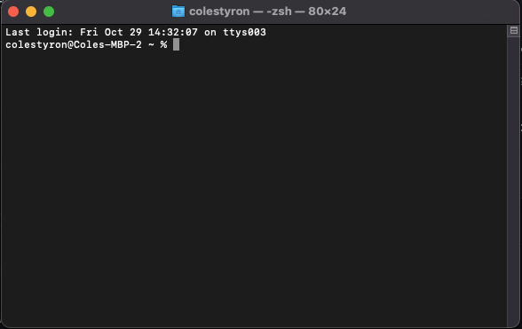
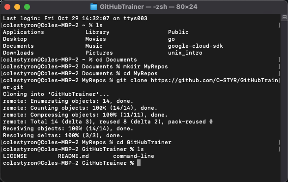

# Using the command line

## Cloning the repo

If you're here, you've elected to learn how to use git and GitHub on the command line. Good choice! This will help develop your understanding of some basic concepts that can only serve you in good stead as the world becomes more and more technologically focused.

Assuming you've already installed `git` on your machine, the next thing to do is clone this repo (short for repository). What's that mean? 

Cloning a repo means copying the online version (which in this case is our "single source of truth", or the standard we all agree to) of this repo to your machine, which we refer to as your "local".

To clone the repo, open another tab [here](https://github.com/C-STYR/GitHubTrainer) and find the button on the upper right hand side of the screen that says `Code` and click it. Click on `HTTPS` under `Clone` and copy the address that's displayed beneath.

Open a terminal window and navigate to the place you want to store this repo on your local machine. For example you might want to choose your Documents folder, and create a directory (folder) there to store it. 

Your terminal will generally open in your "root" directory, which is denoted by a `~`.  Mine looks like this:



The `%` sign is the prompt for a `zsh`-flavored terminal.  If you are using `bash`, you might get a `$` instead. Not to worry. 

If you're on a Mac, your Documents folder should be accessible from your root. Try typing:

```
ls
```

Do you see `Documents` listed? If so, type:

```
cd Documents
```
Now your `~` should have changed to `Documents` as you are no longer in the root directory but now in the Documents directory.

Let's make a new folder for your repo. You can call it whatever you want.  You might have mulitple repos in this directory down the road, so don't call it `GitHubTrainer` (that's what the repo itself is called). Just make sure it's one word, or multiple words without spaces, each starting with a capital letter like `MyRepos`.

I'm going to call mine `MyRepos` for the purposes of the the example. Now type this:
```
mkdir MyReps
cd MyRepos
```
Now you've created a directory and moved into it.  If you haven't already guessed, the `cd` command stands for "change directory".

Now it's time to clone the repo.  To do that, we're going to use the `git clone` command, followed by the url address you copied above, which you'll need to paste in.
```
git clone https://github.com/C-STYR/GitHubTrainer.git
```
Your terminal will now say something like `Cloning into "GitHubTrainer"` while it copies the files.  When it's finished you'll see another prompt. Run this:
```
cd GitHubTrainer
ls
```
and you should see the file structure from the online version mirrored there.

My terminal window looks like this: 



That's it, you're finished with this step. The next thing to do is to install [VS Code](https://code.visualstudio.com/) or the code editor of your choice. I recommend VS Code because it's the modern standard and has an integrated terminal window. If you want to use a different editor, have at it, but these instructions will assume you're using VS Code and you'll need to adapt them to use with your editor. 

Next step: Lesson One